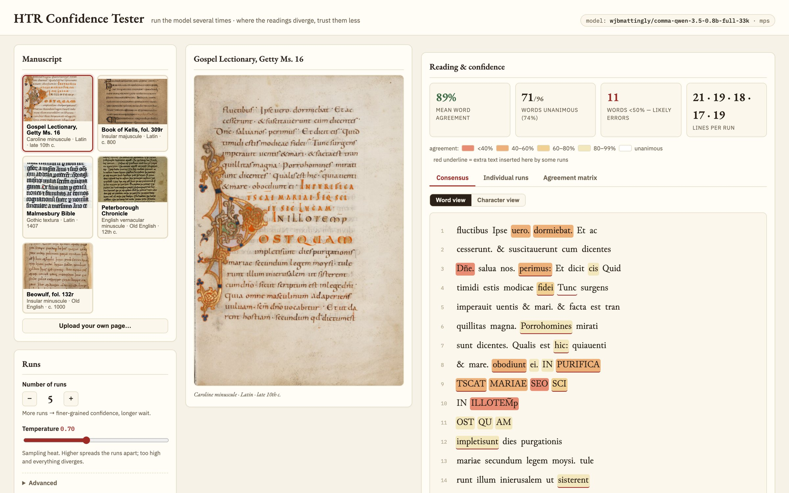
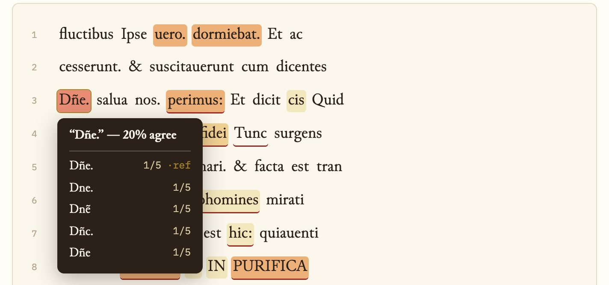
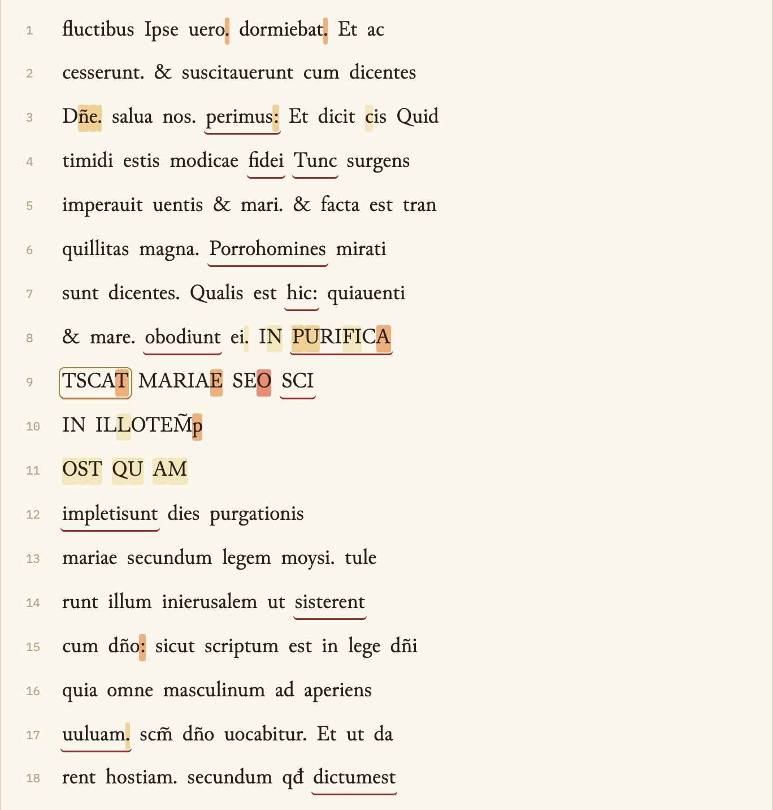
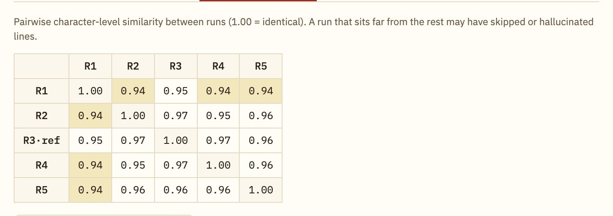
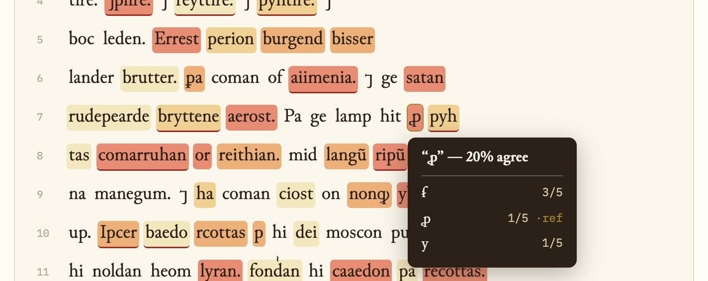
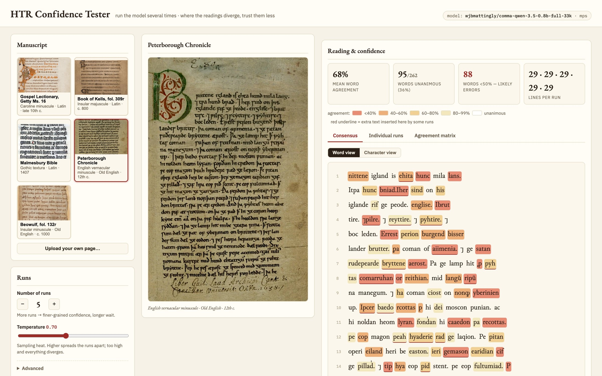
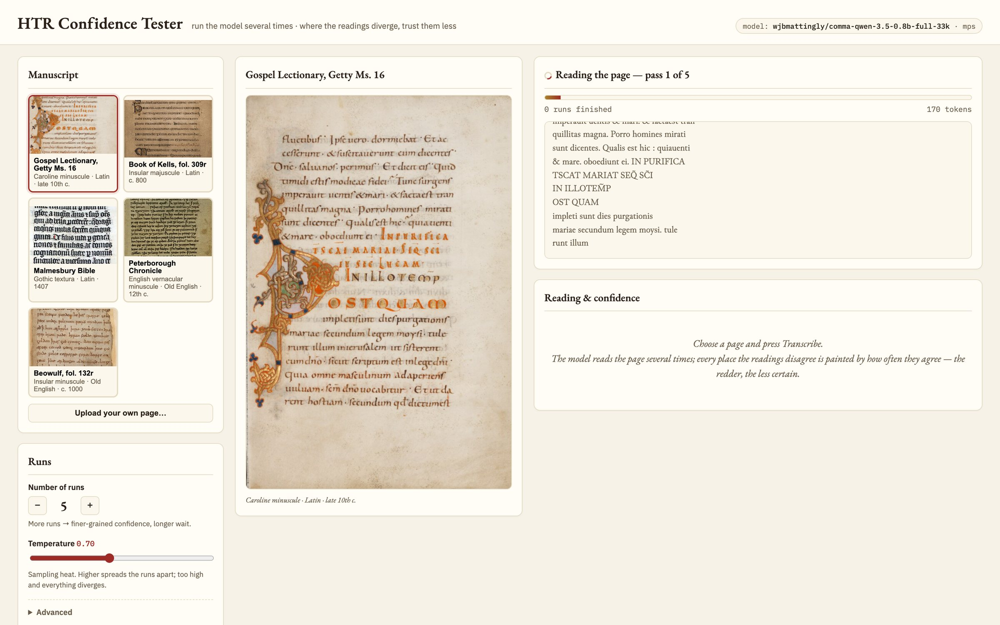

# HTR Confidence Tester

Run a handwritten-text-recognition vision-language model **several times** over the
same manuscript page and use the *divergence between runs* as a confidence signal.
Where every run reads the same word the transcription is probably right; where the
readings scatter, that's where the likely errors concentrate.

The app paints the consensus transcription as a heatmap at the **word** and
**character** level, and clicking any word shows exactly what each run wrote there.



Write-up with worked examples (Carolingian minuscule, and Old English, which the
model never saw): [Where the Readings Disagree](https://wjbmattingly.com/blog/where-the-readings-disagree).

## Screenshots

**Click any word to see every run's reading.** Here the abbreviated *Domine*
came out five different ways in five runs:



**Character view** paints agreement letter by letter, which shows exactly which
stroke the model is unsure of:



**The agreement matrix** compares every run with every other; a run far from the
rest has usually skipped, repeated or invented text:



**Out of domain**, on the Old English Peterborough Chronicle, the barred thorn
(*þæt*) has no Latin equivalent, so each run grabs a different abbreviation sign:





**Progress streams live**, including the text of the pass being generated:



## Model

Defaults to [`wjbmattingly/comma-qwen-3.5-0.8b-full-33k`](https://huggingface.co/wjbmattingly/comma-qwen-3.5-0.8b-full-33k),
a Qwen 3.5 0.8B finetune that produces CATMuS-compliant graphemic transcriptions of
medieval manuscripts, one output line per physical line. Per the model card the app:

- always sends the shipped `prompt.txt` (the CATMuS rule set) as the text input,
- passes `enable_thinking=False` (mandatory — otherwise the model emits prose),
- loads the processor from the finetune repo (visual tokens capped at 2048/page),
- keeps `repetition_penalty=1.1` and `max_new_tokens=3072` as defaults.

The one deliberate departure: the model card decodes greedily (`do_sample=False`),
which would make every run identical. To measure divergence the app samples
(`temperature` 0.7 by default). An optional "greedy first run" toggle adds the
deterministic reading alongside the sampled ones.

### A note on device choice (Mac)

Qwen 3.5 is a hybrid linear-attention architecture (gated delta rule + causal
conv). The fused kernels for those layers (`flash-linear-attention`,
`causal_conv1d`) are Triton/CUDA-only, so on a Mac transformers falls back to a
reference PyTorch implementation. On pure CPU that fallback is unusably slow
(minutes per handful of tokens); on Apple Silicon via **MPS/Metal** it is fast
(7–13 s per full page on an M4 Max, bfloat16, depending on how much text is on it). The app therefore auto-selects
`cuda` if present, then `mps`, and falls back to CPU (float32) otherwise; override with
`HTR_DEVICE=cpu|mps|cuda`. Everything stays fully local either way.

## Usage

```bash
uv run app.py
```

then open <http://127.0.0.1:8765>. First run downloads the checkpoint from
Hugging Face (~2 GB) and loads it once; it stays in memory for subsequent jobs.

Pick one of the five preloaded medieval pages (a Getty Gospel Lectionary, Book of
Kells, Malmesbury Bible, Peterborough Chronicle, Beowulf) or upload your own,
choose the number of runs (default **5**) and press *Transcribe*. Progress streams
live, including the text of the pass currently being generated.

Environment overrides: `HTR_MODEL_REPO` (different finetune), `HTR_DEVICE`
(`cuda`, `mps` or `cpu`; auto-detected by default).

## How confidence is computed

1. All N transcripts are NFC-normalized; the **medoid** (the run most similar to
   all others by `difflib` ratio) becomes the reference shown in the UI.
2. Every other run is aligned to the reference character-by-character
   (`SequenceMatcher`, `autojunk=False`). Equal blocks mark agreement; replaced or
   deleted reference characters mark disagreement; insertions are tracked at the
   gap position where they occur.
3. **Character confidence** = fraction of runs agreeing on that exact character.
   **Word confidence** = fraction of runs whose aligned span reproduces the word
   exactly (word variants and their counts are kept for the click-to-inspect popover).
4. Summary stats: mean word agreement, unanimous words, words below 50%
   (the "likely error" list), lines per run, and a pairwise run-similarity matrix.

The full analysis is downloadable as JSON.

## Files

- `app.py` — FastAPI server, job queue (one generation at a time), upload handling
- `model_runner.py` — model load + streamed sampled generation with cancellation
- `analysis.py` — run alignment and word/char confidence computation
- `static/index.html` — the single-page UI
- `static/fonts/` — [Junicode](https://github.com/psb1558/Junicode-font) (SIL OFL) for
  transcriptions: it covers the MUFI abbreviation characters the prompt asks for
  (ꝑ ꝓ ẜ, combining marks) and Old English letters (þ ð ƿ æ ᵹ)
- `prompt.txt` — CATMuS instruction prompt shipped with the model (do not edit)
- `images/` — preloaded manuscript pages
